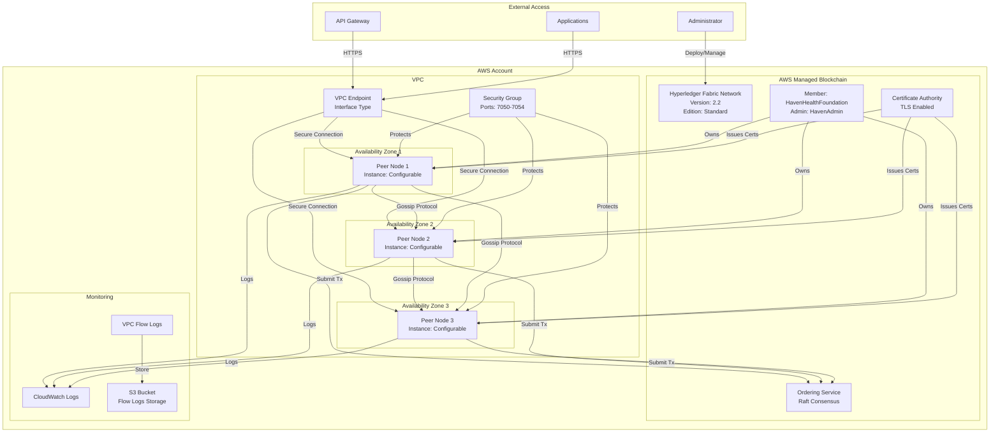

# Haven Health Passport - Blockchain Network Architecture

## Network Diagram

## Network Components

### Core Infrastructure
- **Hyperledger Fabric Network**: Version 2.2, Standard Edition
- **Member Organization**: HavenHealthFoundation
- **Consensus**: Raft-based ordering service
- **Certificate Authority**: Managed by AWS with TLS enabled

### Network Topology
- **Multi-AZ Deployment**: Peer nodes distributed across 3 availability zones
- **High Availability**: Automatic failover and redundancy
- **Scalability**: Up to 5 peer nodes per member in Standard Edition
### Security Configuration
- **VPC Endpoint**: Private connectivity without internet exposure
- **Security Groups**: Restrictive inbound rules (ports 7050-7054)
- **Network ACLs**: Additional layer of network security
- **TLS Encryption**: All communication encrypted in transit

### Monitoring and Logging
- **CloudWatch Logs**:
  - Peer node logs
  - Certificate Authority logs
  - Chaincode execution logs
- **VPC Flow Logs**: Network traffic monitoring
- **Log Retention**: 30 days for operational logs, 90 days for flow logs

### Port Configuration
| Service | Port | Protocol | Description |
|---------|------|----------|-------------|
| Orderer | 7050 | TCP | Transaction ordering service |
| Peer | 7051 | TCP | Peer communication |
| Event | 7053 | TCP | Event service |
| CA | 7054 | TCP | Certificate Authority |

### Access Patterns
1. **Administrative Access**: Through AWS Console/CLI for network management
2. **Application Access**: Via VPC Endpoint using Fabric SDKs
3. **Inter-Peer Communication**: Gossip protocol within VPC

## Deployment Order

1. Deploy blockchain network (CloudFormation)
2. Deploy VPC configuration (Security Groups, VPC Endpoint, Flow Logs)
3. Deploy peer nodes in multiple availability zones
4. Configure channel and deploy chaincode
5. Set up application connectivity

## Disaster Recovery

- **Automated Backups**: Managed by AWS
- **Multi-AZ Redundancy**: Automatic failover
- **Transaction Logs**: Persistent and replicated
- **Certificate Backup**: Store admin credentials securely
