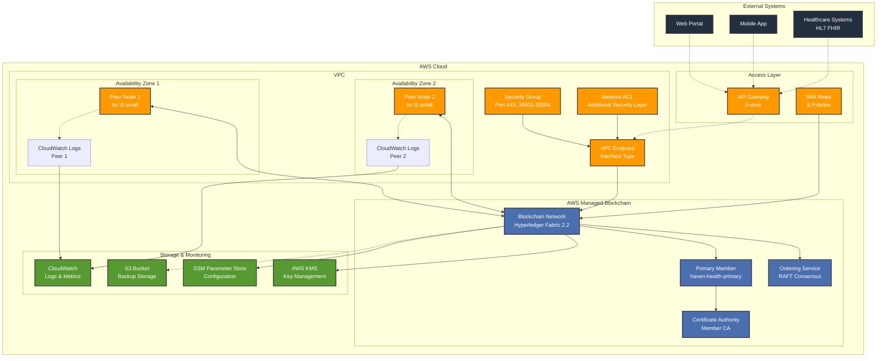

# Haven Health Passport Blockchain Network Diagram

## Network Flow Description

### 1. Client Connection Flow
1. External clients (Web Portal, Mobile App, Healthcare Systems) connect via API Gateway
2. API Gateway routes requests through VPC Endpoint
3. VPC Endpoint provides secure, private connectivity to Managed Blockchain
4. Security Group and Network ACL enforce access policies

### 2. Transaction Flow
1. Client submits transaction to peer node
2. Peer node validates transaction against chaincode
3. Endorsing peers sign the transaction
4. Transaction sent to ordering service
5. Orderer creates block and distributes to all peers
6. Peers validate and commit block to ledger

### 3. Certificate Management Flow
1. New members/users request certificates from CA
2. CA validates identity and issues certificates
3. Certificates stored in user wallet (application-side)
4. All blockchain operations require valid certificates

### 4. Monitoring Flow
1. All components emit logs to CloudWatch
2. Metrics collected for performance monitoring
3. Alerts configured for critical events
4. Regular backups to S3 for disaster recovery

## Security Zones

### Public Zone
- API Gateway (future implementation)
- Public-facing endpoints with WAF protection

### Private Zone
- VPC with private subnets
- Peer nodes and blockchain network
- No direct internet access

### Data Zone
- Encrypted storage in S3
- Configuration in SSM Parameter Store
- Keys managed by AWS KMS

## High Availability Design

1. **Multi-AZ Deployment**: Peer nodes in separate availability zones
2. **Redundant Peers**: Minimum 2 peers for fault tolerance
3. **Automatic Failover**: Managed by AWS Managed Blockchain
4. **Data Replication**: Blockchain ledger replicated across all peers
