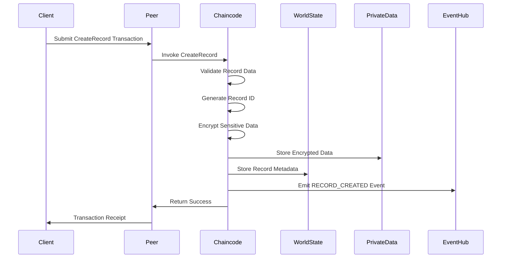
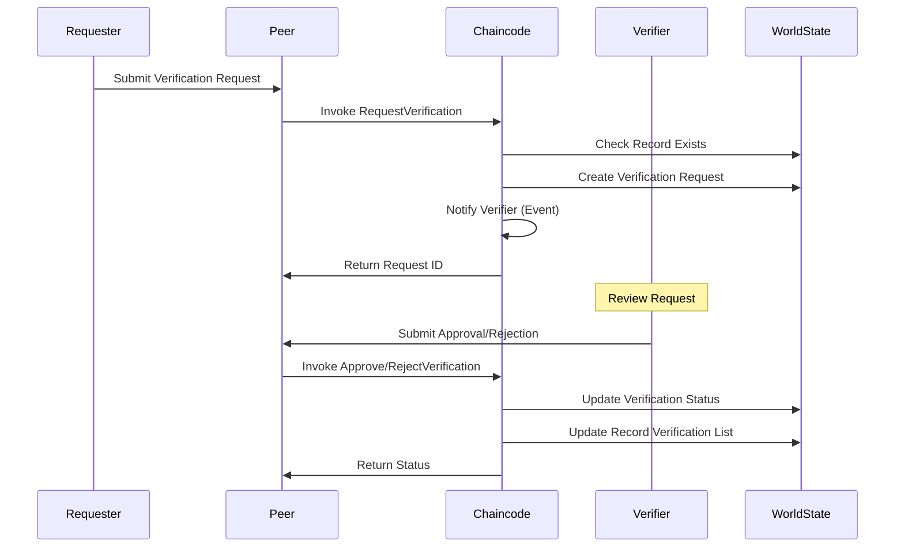

# Chaincode Architecture Design
# Haven Health Passport - Blockchain Smart Contracts

## Package Structure

```
contracts/chaincode/
├── health-records/                 # Health record management chaincode
│   ├── go.mod
│   ├── go.sum
│   ├── main.go                    # Entry point
│   ├── contracts/
│   │   ├── health_record.go       # Main health record contract
│   │   ├── verification.go        # Verification contract
│   │   └── access_control.go      # Access control contract
│   ├── models/
│   │   ├── record.go             # Health record data model
│   │   ├── verification.go       # Verification data model
│   │   └── access.go            # Access control data model
│   ├── utils/
│   │   ├── encryption.go        # Encryption utilities
│   │   ├── validation.go        # Validation functions
│   │   └── keys.go             # Key generation utilities
│   └── tests/
│       ├── health_record_test.go
│       ├── verification_test.go
│       └── access_control_test.go
├── identity/                      # Identity management chaincode
├── audit/                        # Audit trail chaincode
└── collections/                  # Private data collection configs
```

## Contract Interface Definitions

### HealthRecordContract Interface
```go
type HealthRecordContract interface {
    // Record Management
    CreateRecord(ctx contractapi.TransactionContextInterface, record HealthRecord) error
    UpdateRecord(ctx contractapi.TransactionContextInterface, recordID string, updates map[string]interface{}) error
    ReadRecord(ctx contractapi.TransactionContextInterface, recordID string) (*HealthRecord, error)
    DeleteRecord(ctx contractapi.TransactionContextInterface, recordID string) error

    // Query Functions
    QueryRecordsByPatient(ctx contractapi.TransactionContextInterface, patientID string) ([]*HealthRecord, error)
    QueryRecordsByProvider(ctx contractapi.TransactionContextInterface, providerID string) ([]*HealthRecord, error)
    QueryRecordHistory(ctx contractapi.TransactionContextInterface, recordID string) ([]*HistoryRecord, error)

    // Bulk Operations
    CreateRecordsBatch(ctx contractapi.TransactionContextInterface, records []HealthRecord) error
}
```

### VerificationContract Interface
```go
type VerificationContract interface {
    RequestVerification(ctx contractapi.TransactionContextInterface, request VerificationRequest) error
    ApproveVerification(ctx contractapi.TransactionContextInterface, requestID string, approverID string) error
    RejectVerification(ctx contractapi.TransactionContextInterface, requestID string, reason string) error
    RevokeVerification(ctx contractapi.TransactionContextInterface, verificationID string, reason string) error
    QueryVerificationStatus(ctx contractapi.TransactionContextInterface, recordID string) (*VerificationStatus, error)
}
```

### AccessControlContract Interface
```go
type AccessControlContract interface {
    GrantAccess(ctx contractapi.TransactionContextInterface, grant AccessGrant) error
    RevokeAccess(ctx contractapi.TransactionContextInterface, grantID string) error
    CheckAccess(ctx contractapi.TransactionContextInterface, userID string, resourceID string, action string) (bool, error)
    QueryAccessGrants(ctx contractapi.TransactionContextInterface, userID string) ([]*AccessGrant, error)
    CreateAccessPolicy(ctx contractapi.TransactionContextInterface, policy AccessPolicy) error
}
```

## State Data Models

### Health Record State
```go
type HealthRecord struct {
    RecordID        string                 `json:"recordId"`
    PatientID       string                 `json:"patientId"`
    ProviderID      string                 `json:"providerId"`
    RecordType      string                 `json:"recordType"`
    CreatedAt       time.Time              `json:"createdAt"`
    UpdatedAt       time.Time              `json:"updatedAt"`
    Version         int                    `json:"version"`
    EncryptedData   string                 `json:"encryptedData"`
    DataHash        string                 `json:"dataHash"`
    Metadata        map[string]interface{} `json:"metadata"`
    VerificationIDs []string               `json:"verificationIds"`
    AccessGrants    []string               `json:"accessGrants"`
    Status          string                 `json:"status"`
}
```

### Verification State
```go
type VerificationRequest struct {
    RequestID    string    `json:"requestId"`
    RecordID     string    `json:"recordId"`
    RequesterID  string    `json:"requesterId"`
    VerifierID   string    `json:"verifierId"`
    RequestedAt  time.Time `json:"requestedAt"`
    Status       string    `json:"status"`
    Evidence     string    `json:"evidence"`
    Comments     string    `json:"comments"`
}

type VerificationStatus struct {
    VerificationID string    `json:"verificationId"`
    RecordID       string    `json:"recordId"`
    VerifierID     string    `json:"verifierId"`
    VerifiedAt     time.Time `json:"verifiedAt"`
    ExpiresAt      time.Time `json:"expiresAt"`
    Status         string    `json:"status"`
    Signature      string    `json:"signature"`
}
```

### Access Control State
```go
type AccessGrant struct {
    GrantID      string    `json:"grantId"`
    ResourceID   string    `json:"resourceId"`
    GrantorID    string    `json:"grantorId"`
    GranteeID    string    `json:"granteeId"`
    Permissions  []string  `json:"permissions"`
    GrantedAt    time.Time `json:"grantedAt"`
    ExpiresAt    time.Time `json:"expiresAt"`
    Conditions   []string  `json:"conditions"`
    Status       string    `json:"status"`
}

type AccessPolicy struct {
    PolicyID     string                 `json:"policyId"`
    PolicyName   string                 `json:"policyName"`
    ResourceType string                 `json:"resourceType"`
    Rules        []AccessRule           `json:"rules"`
    CreatedBy    string                 `json:"createdBy"`
    CreatedAt    time.Time              `json:"createdAt"`
    Active       bool                   `json:"active"`
}
```

## Key Naming Conventions

### Primary Keys
- Health Records: `RECORD~{RecordType}~{PatientID}~{RecordID}`
- Verifications: `VERIFY~{RecordID}~{VerificationID}`
- Access Grants: `ACCESS~{ResourceID}~{GranteeID}~{GrantID}`
- Policies: `POLICY~{ResourceType}~{PolicyID}`

### Composite Keys
- Patient Records: `PATIENT~RECORDS~{PatientID}`
- Provider Records: `PROVIDER~RECORDS~{ProviderID}`
- Record Verifications: `RECORD~VERIFICATIONS~{RecordID}`
- User Access Grants: `USER~GRANTS~{UserID}`

## Private Data Collections

### Collection Configurations

```json
[
  {
    "name": "personalHealthData",
    "policy": "OR('HavenHealthMSP.member', 'PartnerOrgMSP.member')",
    "requiredPeerCount": 1,
    "maxPeerCount": 3,
    "blockToLive": 0,
    "memberOnlyRead": true,
    "memberOnlyWrite": true
  },
  {
    "name": "sensitiveRecords",
    "policy": "AND('HavenHealthMSP.member', 'PatientOrgMSP.member')",
    "requiredPeerCount": 2,
    "maxPeerCount": 4,
    "blockToLive": 1000000,
    "memberOnlyRead": true,
    "memberOnlyWrite": false
  },
  {
    "name": "verificationData",
    "policy": "OR('HavenHealthMSP.member', 'VerifierOrgMSP.member')",
    "requiredPeerCount": 1,
    "maxPeerCount": 2,
    "blockToLive": 0,
    "memberOnlyRead": false,
    "memberOnlyWrite": true
  }
]
```

## Access Control Policies

### Role-Based Access Control (RBAC)
```go
const (
    RolePatient       = "PATIENT"
    RoleProvider      = "PROVIDER"
    RoleVerifier      = "VERIFIER"
    RoleAdministrator = "ADMINISTRATOR"
    RoleEmergency     = "EMERGENCY"
)

type RolePermissions map[string][]string

var DefaultPermissions = RolePermissions{
    RolePatient: []string{"read:own", "write:own", "grant:own", "revoke:own"},
    RoleProvider: []string{"read:assigned", "write:assigned", "verify:request"},
    RoleVerifier: []string{"read:verification", "verify:approve", "verify:reject"},
    RoleAdministrator: []string{"read:all", "audit:all", "policy:manage"},
    RoleEmergency: []string{"read:emergency", "override:temporary"},
}
```

## Endorsement Policies

### Policy Definitions
```yaml
# Health Record Creation
HealthRecordCreation:
  identities:
    - role: { name: "member", mspId: "HavenHealthMSP" }
    - role: { name: "member", mspId: "ProviderOrgMSP" }
  policy:
    signed-by: 0  # HavenHealthMSP member

# Verification Approval
VerificationApproval:
  identities:
    - role: { name: "member", mspId: "HavenHealthMSP" }
    - role: { name: "member", mspId: "VerifierOrgMSP" }
  policy:
    n-out-of:
      n: 2
      rules:
        - signed-by: 0
        - signed-by: 1

# Access Grant
AccessGrant:
  identities:
    - role: { name: "member", mspId: "HavenHealthMSP" }
    - role: { name: "client", mspId: "PatientOrgMSP" }
  policy:
    or:
      - signed-by: 0
      - signed-by: 1
```

## Validation Rules

### Health Record Validation
```go
type RecordValidator struct {
    RequiredFields []string
    MaxDataSize    int
    AllowedTypes   []string
}

var HealthRecordValidation = RecordValidator{
    RequiredFields: []string{"patientId", "providerId", "recordType", "dataHash"},
    MaxDataSize:    10 * 1024 * 1024, // 10MB
    AllowedTypes:   []string{"medical_history", "prescription", "lab_result", "imaging", "vaccination", "consultation"},
}

// Validation Functions
func ValidateHealthRecord(record *HealthRecord) error {
    // Check required fields
    // Validate data size
    // Verify record type
    // Validate timestamps
    // Check encryption status
    return nil
}
```

### Access Control Validation
```go
func ValidateAccessGrant(grant *AccessGrant) error {
    // Validate grantor has permission to grant
    // Check grantee identity
    // Validate permission scope
    // Verify expiration time
    // Check conditions format
    return nil
}
```

## Business Logic Constraints

### Record Constraints
1. **Immutability**: Once created, health records cannot be modified, only new versions can be added
2. **Encryption**: All personal health data must be encrypted before storage
3. **Verification Window**: Verification requests expire after 72 hours if not processed
4. **Access Duration**: Default access grants expire after 30 days unless explicitly extended
5. **Audit Trail**: All operations must generate audit events

### Version Management
```go
type VersioningStrategy struct {
    MaxVersions        int
    RetentionPeriod    time.Duration
    ArchiveOldVersions bool
}

var DefaultVersioning = VersioningStrategy{
    MaxVersions:        10,
    RetentionPeriod:    365 * 24 * time.Hour, // 1 year
    ArchiveOldVersions: true,
}
```

## Upgrade Mechanisms

### Chaincode Lifecycle
1. **Version Tracking**: Semantic versioning (MAJOR.MINOR.PATCH)
2. **Compatibility Matrix**: Maintain backward compatibility for 2 major versions
3. **Migration Scripts**: Automated data migration between versions
4. **Rollback Capability**: Support rollback to previous version within 24 hours

### Upgrade Process
```yaml
upgrade_steps:
  1_preparation:
    - backup_current_state
    - validate_new_version
    - check_endorsement_policy
  2_deployment:
    - install_new_chaincode
    - approve_chaincode_definition
    - commit_chaincode_definition
  3_migration:
    - run_data_migration
    - validate_migrated_data
    - update_indexes
  4_verification:
    - run_smoke_tests
    - verify_backwards_compatibility
    - monitor_performance
```

## Initialization Logic

### Chaincode Initialization
```go
func (c *HealthRecordContract) InitLedger(ctx contractapi.TransactionContextInterface) error {
    // Initialize default policies
    policies := []AccessPolicy{
        {
            PolicyID:     "DEFAULT_PATIENT_POLICY",
            PolicyName:   "Default Patient Access Policy",
            ResourceType: "health_record",
            Rules: []AccessRule{
                {RuleID: "RULE001", Role: "PATIENT", Actions: []string{"read:own", "grant:own"}},
                {RuleID: "RULE002", Role: "PROVIDER", Actions: []string{"read:assigned", "write:assigned"}},
            },
        },
        {
            PolicyID:     "EMERGENCY_ACCESS_POLICY",
            PolicyName:   "Emergency Access Policy",
            ResourceType: "health_record",
            Rules: []AccessRule{
                {RuleID: "EMRG001", Role: "EMERGENCY", Actions: []string{"read:emergency"}, Duration: "1h"},
            },
        },
    }

    // Initialize indexes
    // Set up event listeners
    // Configure private data collections

    return nil
}
```

## World State Structure

### State Organization
```
World State
├── Health Records
│   ├── Active Records (current versions)
│   ├── Historical Records (previous versions)
│   └── Archived Records (soft-deleted)
├── Verifications
│   ├── Pending Requests
│   ├── Approved Verifications
│   └── Revoked Verifications
├── Access Control
│   ├── Active Grants
│   ├── Expired Grants
│   └── Access Policies
├── Audit Trail
│   ├── Transaction Logs
│   ├── Access Logs
│   └── System Events
└── Metadata
    ├── Indexes
    ├── Counters
    └── Configuration
```

## Index Optimization

### CouchDB Indexes
```json
{
  "indexes": [
    {
      "index": {
        "fields": ["patientId", "recordType", "createdAt"]
      },
      "name": "patient-records-index",
      "type": "json"
    },
    {
      "index": {
        "fields": ["providerId", "status", "updatedAt"]
      },
      "name": "provider-records-index",
      "type": "json"
    },
    {
      "index": {
        "fields": ["recordId", "verificationStatus"]
      },
      "name": "verification-status-index",
      "type": "json"
    },
    {
      "index": {
        "fields": ["granteeId", "resourceId", "expiresAt"]
      },
      "name": "access-grants-index",
      "type": "json"
    }
  ]
}
```

## Query Mechanisms

### Rich Query Support
```go
// Pagination Query
func (c *HealthRecordContract) QueryRecordsWithPagination(
    ctx contractapi.TransactionContextInterface,
    queryString string,
    pageSize int32,
    bookmark string,
) (*PaginatedQueryResult, error) {
    resultsIterator, responseMetadata, err := ctx.GetStub().GetQueryResultWithPagination(
        queryString,
        pageSize,
        bookmark,
    )
    // Process results with pagination
    return &PaginatedQueryResult{
        Records:      records,
        Bookmark:     responseMetadata.Bookmark,
        FetchedCount: responseMetadata.FetchedRecordsCount,
    }, nil
}

// Complex Query Examples
const (
    QueryPatientRecordsByDate = `{
        "selector": {
            "patientId": "%s",
            "createdAt": {"$gte": "%s", "$lte": "%s"},
            "status": "active"
        },
        "sort": [{"createdAt": "desc"}],
        "limit": %d
    }`

    QueryPendingVerifications = `{
        "selector": {
            "status": "pending",
            "requestedAt": {"$lte": "%s"}
        },
        "fields": ["requestId", "recordId", "requesterId", "requestedAt"]
    }`
)
```

## Event Definitions

### Event Types
```go
const (
    // Record Events
    EventRecordCreated   = "RECORD_CREATED"
    EventRecordUpdated   = "RECORD_UPDATED"
    EventRecordDeleted   = "RECORD_DELETED"
    EventRecordAccessed  = "RECORD_ACCESSED"

    // Verification Events
    EventVerificationRequested = "VERIFICATION_REQUESTED"
    EventVerificationApproved  = "VERIFICATION_APPROVED"
    EventVerificationRejected  = "VERIFICATION_REJECTED"
    EventVerificationRevoked   = "VERIFICATION_REVOKED"

    // Access Events
    EventAccessGranted  = "ACCESS_GRANTED"
    EventAccessRevoked  = "ACCESS_REVOKED"
    EventAccessExpired  = "ACCESS_EXPIRED"
    EventAccessDenied   = "ACCESS_DENIED"
)

// Event Structure
type ChainEvent struct {
    EventID     string                 `json:"eventId"`
    EventType   string                 `json:"eventType"`
    EntityID    string                 `json:"entityId"`
    ActorID     string                 `json:"actorId"`
    Timestamp   time.Time              `json:"timestamp"`
    Details     map[string]interface{} `json:"details"`
    Signature   string                 `json:"signature"`
}

// Emit Event Function
func EmitEvent(ctx contractapi.TransactionContextInterface, event ChainEvent) error {
    eventBytes, _ := json.Marshal(event)
    return ctx.GetStub().SetEvent(event.EventType, eventBytes)
}
```

## Transaction Flow

### Health Record Creation Flow


### Verification Request Flow


### Access Control Flow
```
1. Access Request
   - User requests access to resource
   - System checks user identity and role
   - Validates request against policies

2. Permission Evaluation
   - Load applicable access policies
   - Check existing access grants
   - Evaluate conditions (time, location, etc.)
   - Calculate effective permissions

3. Access Decision
   - Grant: Create access token, log event
   - Deny: Log denial reason, notify user
   - Conditional: Apply restrictions

4. Access Monitoring
   - Track resource usage
   - Monitor for anomalies
   - Auto-revoke on violation
   - Generate audit trail
```

## Implementation Notes

### Performance Considerations
1. Use batch operations for bulk record creation
2. Implement caching for frequently accessed policies
3. Optimize query patterns with appropriate indexes
4. Use pagination for large result sets
5. Implement connection pooling for external services

### Security Best Practices
1. All sensitive data encrypted at rest
2. TLS for all network communications
3. Regular key rotation (90 days)
4. Audit all access attempts
5. Implement rate limiting
6. Use hardware security modules (HSM) for key management

### Compliance Requirements
1. HIPAA: Ensure all PHI is encrypted and access is logged
2. GDPR: Implement right to deletion and data portability
3. Data Residency: Ensure data stays within specified regions
4. Audit Trail: Maintain immutable audit log for 7 years

---
*Document Version: 1.0*
*Last Updated: January 2024*
*Next Review: April 2024*
