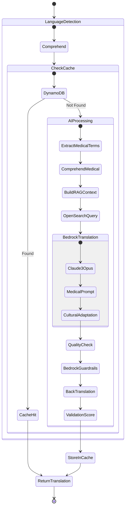
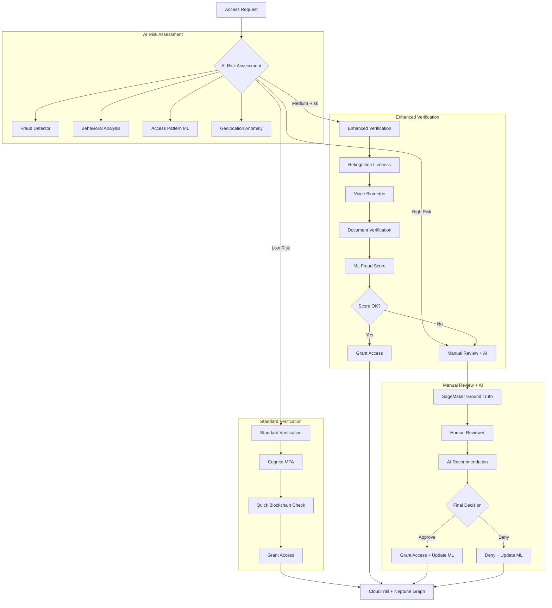
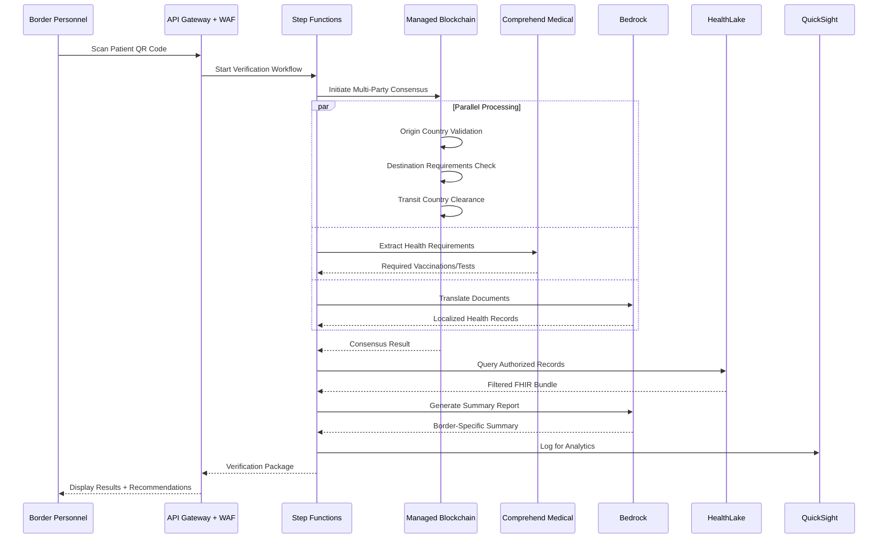
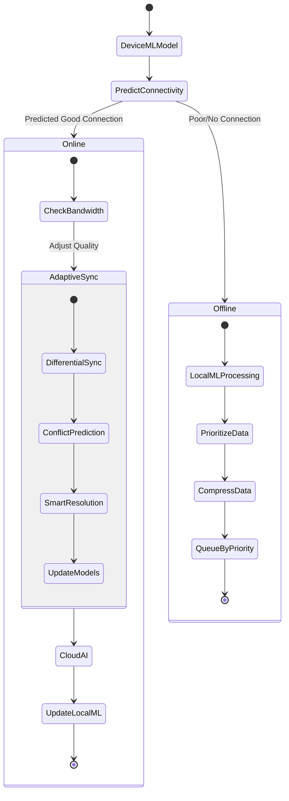
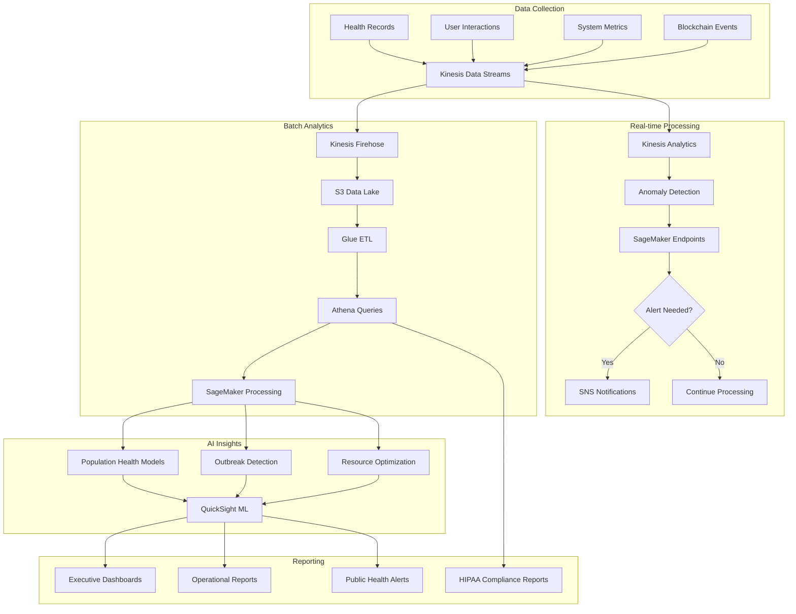

        }
    )
    
    # 5. FHIR Conversion
    fhir_bundle = convert_to_fhir(entities, icd10_codes, rxnorm_codes, enhanced_data)
    
    # 6. Store in HealthLake
    await healthlake.create_resource(fhir_bundle)
    
    return fhir_bundle
```

## 3. Translation and Cultural Adaptation Flow with AWS AI



### Advanced Translation Pipeline
```python
class MedicalTranslationPipeline:
    def __init__(self):
        self.comprehend = boto3.client('comprehend')
        self.comprehend_medical = boto3.client('comprehendmedical')
        self.bedrock = boto3.client('bedrock-runtime')
        self.translate = boto3.client('translate')
        self.opensearch = OpenSearchClient()
        
    async def translate_medical_text(self, text, source_lang, target_lang, cultural_context):
        # 1. Extract medical entities to preserve
        medical_entities = await self.comprehend_medical.detect_entities_v2(Text=text)
        
        # 2. Build RAG context from medical knowledge base
        rag_context = await self.opensearch.vector_search(
            index='medical-translations',
            query_vector=await self.get_embedding(text),
            filter={'source_lang': source_lang, 'target_lang': target_lang}
        )
        
        # 3. Create medical translation prompt
        prompt = f"""You are a medical translator with expertise in refugee healthcare.
        Translate the following medical text from {source_lang} to {target_lang}.
        
        Important medical terms to preserve accurately:
        {json.dumps(medical_entities['Entities'])}
        
        Similar translations for reference:
        {rag_context}
        
        Cultural context: {cultural_context}
        
        Text to translate: {text}
        
        Provide a medically accurate translation that is culturally appropriate."""
        
        # 4. Get translation from Bedrock
        response = await self.bedrock.invoke_model(
            modelId='anthropic.claude-3-opus',
            body={
                'prompt': prompt,
                'temperature': 0.1,  # Low temperature for accuracy
                'max_tokens': 2048
            }
        )
        
        # 5. Validate with guardrails
        validated = await self.bedrock.apply_guardrail(
            guardrailIdentifier='medical-translation-guardrail',
            content=response['translation']
        )
        
        # 6. Back-translation verification
        back_translation = await self.translate.translate_text(
            Text=validated['content'],
            SourceLanguageCode=target_lang,
            TargetLanguageCode=source_lang,
            TerminologyNames=['medical-terms']
        )
        
        # 7. Calculate confidence score
        confidence = await self.calculate_translation_confidence(
            original=text,
            back_translated=back_translation['TranslatedText']
        )
        
        return {
            'translation': validated['content'],
            'confidence': confidence,
            'medical_entities_preserved': len(medical_entities['Entities'])
        }
```

## 4. Verification and Access Control Flow with AI



### AI-Powered Access Control
```python
class AIAccessController:
    def __init__(self):
        self.fraud_detector = boto3.client('frauddetector')
        self.rekognition = boto3.client('rekognition')
        self.sagemaker = boto3.client('sagemaker-runtime')
        self.neptune = NeptuneClient()
        
    async def evaluate_access_request(self, request):
        # 1. Real-time fraud detection
        fraud_score = await self.fraud_detector.get_event_prediction(
            detectorId='healthcare-access-detector',
            eventId=request.id,
            eventTypeName='HEALTHCARE_ACCESS',
            entities=[{'entityType': 'requester', 'entityId': request.user_id}],
            eventVariables={
                'ip_address': request.ip,
                'user_agent': request.user_agent,
                'access_type': request.type,
                'location': request.location,
                'time_since_last_access': request.time_delta
            }
        )
        
        # 2. Behavioral analysis using Neptune graph
        behavior_risk = await self.neptune.query("""
            g.V().has('user', 'id', '{}')
            .outE('accessed').inV()
            .groupCount().by('access_pattern')
            .select(values)
        """.format(request.user_id))
        
        # 3. Custom ML model for access patterns
        ml_risk = await self.sagemaker.invoke_endpoint(
            EndpointName='access-risk-classifier',
            Body=json.dumps({
                'features': {
                    'user_history': behavior_risk,
                    'request_context': request.to_dict(),
                    'fraud_score': fraud_score['riskScore']
                }
            })
        )
        
        # 4. Determine verification level
        risk_level = self.calculate_risk_level(
            fraud_score['riskScore'],
            behavior_risk,
            ml_risk['predictions'][0]['score']
        )
        
        return {
            'risk_level': risk_level,
            'verification_required': self.get_verification_requirements(risk_level),
            'ai_explanation': await self.generate_risk_explanation(risk_level, request)
        }
```

## 5. Cross-Border Verification Flow with AWS



### Cross-Border AI Integration
```yaml
Step Functions Workflow:
  States:
    - CheckDocumentCompleteness:
        Type: Task
        Resource: Lambda:CheckDocuments
        Parameters:
          AI_Service: Textract
          Validation: Comprehend Medical
    
    - TranslateForBorder:
        Type: Parallel
        Branches:
          - TranslateDocuments:
              Service: Bedrock
              Model: Claude-3-Opus
              Context: Border-specific medical terms
          - GenerateVisualSummary:
              Service: Bedrock
              Model: Stable-Diffusion-XL
              Output: Infographic for officials
    
    - VerifyHealthRequirements:
        Type: Task
        Resource: SageMaker:InvokeEndpoint
        Parameters:
          Endpoint: health-requirements-matcher
          Input: 
            - Patient medical history
            - Destination country rules
            - Current health alerts
    
    - GenerateRecommendations:
        Type: Task  
        Resource: Bedrock:InvokeModel
        Parameters:
          Model: Claude-3-Opus
          Prompt: Border health recommendations
          Guardrails: medical-accuracy
```

## 6. Emergency Access Flow with AI Assistance

```python
# AI-Enhanced Emergency Access Protocol
class EmergencyAccessAI:
    def __init__(self):
        self.bedrock = BedrockClient()
        self.comprehend_medical = ComprehendMedicalClient()
        self.transcribe_medical = TranscribeMedicalClient()
        self.step_functions = StepFunctionsClient()
        
    async def emergency_access_protocol(self, patient_id, provider_id, emergency_context):
        # 1. AI-powered provider verification
        provider_verification = await self.verify_emergency_provider_ai(provider_id)
        
        # 2. Intelligent record filtering based on emergency type
        workflow_input = {
            'stateMachineArn': 'arn:aws:states:region:account:stateMachine:emergency-access',
            'input': json.dumps({
                'patient_id': patient_id,
                'provider_id': provider_id,
                'emergency_type': emergency_context['type'],
                'symptoms': emergency_context.get('symptoms', []),
                'vital_signs': emergency_context.get('vitals', {})
            })
        }
        
        execution = await self.step_functions.start_execution(**workflow_input)
        
        # 3. Real-time translation for provider's language
        if provider_verification['language'] != 'en':
            await self.setup_real_time_translation(
                source_lang='en',
                target_lang=provider_verification['language'],
                medical_specialty=provider_verification['specialty']
            )
        
        # 4. AI-generated emergency summary
        emergency_summary = await self.bedrock.invoke_model(
            modelId='anthropic.claude-3-opus',
            body={
                'prompt': f"""Generate emergency medical summary for:
                Emergency Type: {emergency_context['type']}
                Patient ID: {patient_id}
                Focus on immediately relevant medical history.
                Include: allergies, current medications, recent procedures, chronic conditions.
                Format for emergency room use.""",
                'temperature': 0.1
            }
        )
        
        # 5. Setup continuous monitoring
        monitoring_session = await self.setup_ai_monitoring(
            patient_id=patient_id,
            provider_id=provider_id,
            duration_hours=24
        )
        
        return {
            'access_granted': True,
            'filtered_records': execution['output'],
            'emergency_summary': emergency_summary,
            'translation_session': workflow_input.get('translation_session'),
            'monitoring_session': monitoring_session,
            'expires_at': datetime.utcnow() + timedelta(hours=24)
        }
```

## 7. Data Synchronization Flow with AI Optimization

### Intelligent Offline-First Sync


### AI-Powered Sync Strategy
```python
class IntelligentSyncEngine:
    def __init__(self):
        self.sagemaker_edge = SageMakerEdgeManager()
        self.iot_analytics = IoTAnalyticsClient()
        self.personalize = PersonalizeClient()
        
    async def optimize_sync_strategy(self, device_context):
        # 1. Predict network availability using on-device ML
        network_prediction = await self.sagemaker_edge.predict(
            model='network-availability-predictor',
            features={
                'time_of_day': device_context['time'],
                'location': device_context['location'],
                'battery_level': device_context['battery'],
                'historical_connectivity': device_context['conn_history']
            }
        )
        
        # 2. Personalized sync priorities
        sync_priorities = await self.personalize.get_recommendations(
            campaignArn='arn:aws:personalize:region:account:campaign/sync-priority',
            userId=device_context['user_id'],
            context={
                'device_type': device_context['device'],
                'available_storage': device_context['storage']
            }
        )
        
        # 3. Adaptive compression based on content
        compression_strategy = await self.determine_compression(
            data_types=device_context['pending_sync_types'],
            network_quality=network_prediction['quality_score']
        )
        
        # 4. Conflict prediction and preemptive resolution
        conflict_probability = await self.predict_conflicts(
            local_changes=device_context['local_changes'],
            last_sync=device_context['last_sync_time']
        )
        
        return {
            'sync_now': network_prediction['quality_score'] > 0.7,
            'priorities': sync_priorities['itemList'],
            'compression': compression_strategy,
            'conflict_strategy': 'preemptive' if conflict_probability > 0.5 else 'standard'
        }
```

## 8. Analytics and Reporting Flow with AWS AI



### Advanced Analytics Pipeline
```python
class HealthAnalyticsAI:
    def __init__(self):
        self.sagemaker = SageMakerClient()
        self.quicksight = QuickSightClient()
        self.forecast = ForecastClient()
        self.healthlake = HealthLakeClient()
        
    async def process_population_health(self, region, timeframe):
        # 1. Differential privacy for patient data
        private_data = await self.apply_differential_privacy(
            query="SELECT demographics, conditions FROM patients WHERE region = ?",
            epsilon=1.0,  # Privacy budget
            region=region
        )
        
        # 2. ML-based disease pattern detection
        disease_patterns = await self.sagemaker.invoke_endpoint(
            EndpointName='disease-pattern-detector',
            Body=json.dumps({
                'data': private_data,
                'timeframe': timeframe,
                'features': ['age_groups', 'conditions', 'medications', 'vaccinations']
            })
        )
        
        # 3. Outbreak prediction using Forecast
        outbreak_forecast = await self.forecast.create_forecast(
            ForecastName=f'outbreak-{region}-{datetime.now().isoformat()}',
            PredictorArn='arn:aws:forecast:region:account:predictor/health-outbreak-predictor'
        )
        
        # 4. Generate AI insights
        insights = await self.bedrock.invoke_model(
            modelId='anthropic.claude-3-opus',
            body={
                'prompt': f"""Analyze health patterns for {region}:
                Disease Patterns: {disease_patterns}
                Outbreak Risk: {outbreak_forecast}
                
                Provide:
                1. Key health trends
                2. Risk factors
                3. Intervention recommendations
                4. Resource allocation suggestions""",
                'temperature': 0.2
            }
        )
        
        # 5. Create interactive visualizations
        dashboard = await self.quicksight.create_analysis(
            AwsAccountId='account-id',
            AnalysisId=f'health-analysis-{region}',
            Name=f'Population Health Analysis - {region}',
            SourceEntity={
                'SourceTemplate': {
                    'Arn': 'arn:aws:quicksight:region:account:template/health-ml-template',
                    'DataSetReferences': [{
                        'DataSetPlaceholder': 'health_data',
                        'DataSetArn': f'arn:aws:quicksight:region:account:dataset/{region}-health'
                    }]
                }
            }
        )
        
        return {
            'patterns': disease_patterns,
            'forecast': outbreak_forecast,
            'insights': insights,
            'dashboard_url': dashboard['DashboardUrl']
        }
```

## Data Retention and AI Lifecycle Management

### AI Model Versioning and Data Governance
```yaml
Model Lifecycle:
  Training:
    - Service: SageMaker Pipelines
    - Data: Anonymized patient records
    - Validation: 80/20 split with temporal validation
    - Bias Detection: SageMaker Clarify
    
  Deployment:
    - A/B Testing: 10% traffic to new models
    - Shadow Mode: Run new models in parallel
    - Rollback: Automatic on performance degradation
    
  Monitoring:
    - Model Monitor: Drift detection
    - Data Quality: Continuous validation
    - Performance Metrics: Real-time tracking
    
  Retraining:
    - Trigger: Monthly or on drift detection
    - Incremental Learning: New data integration
    - Federated Learning: Privacy-preserving updates

Data Governance:
  Retention:
    - Active AI Training Data: 2 years
    - Model Artifacts: 5 years
    - Inference Logs: 1 year
    - Audit Trail: 10 years
    
  Privacy:
    - Differential Privacy: All analytics
    - Homomorphic Encryption: Sensitive computations
    - Secure Multi-party Computation: Cross-border analytics
    
  Compliance:
    - GDPR: Right to erasure from training data
    - HIPAA: De-identification for AI training
    - Cross-border: Data residency for AI processing
```

## Performance Metrics

| Flow Component | AWS Service | Target Latency | Throughput |
|----------------|-------------|----------------|------------|
| Document Processing | Textract + Comprehend Medical | < 3s/page | 1000 pages/min |
| Real-time Translation | Bedrock Claude 3 | < 2s | 500 req/min |
| Voice Transcription | Transcribe Medical | Real-time | 100 concurrent |
| Emergency Access | Step Functions + AI | < 30s | 1000 req/min |
| Cross-border Verification | Managed Blockchain + AI | < 2min | 500 req/min |
| Analytics Pipeline | SageMaker + QuickSight | < 5min | Daily batch |