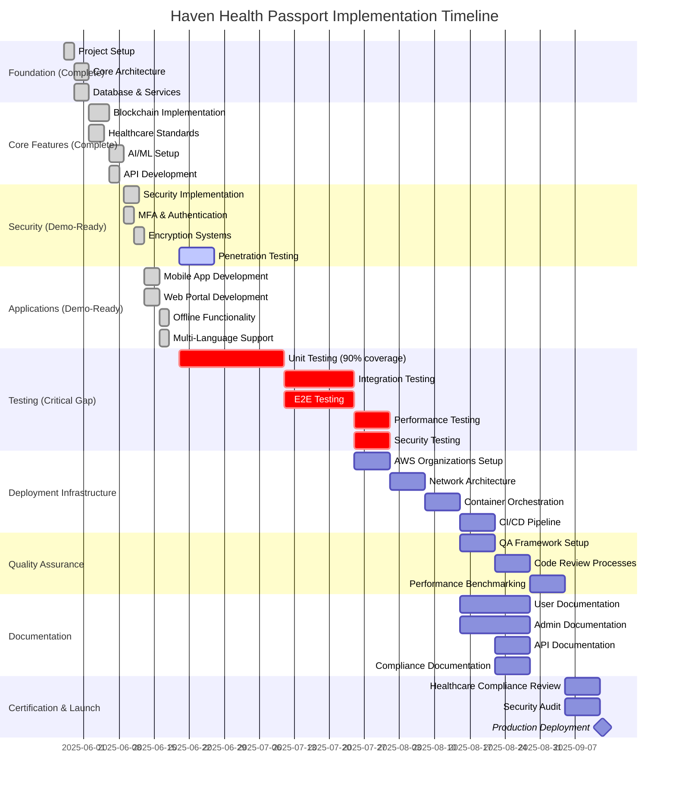

# Haven Health Passport - Development and Implementation Timeline

## Current Status Overview

Based on comprehensive checklist audit:
- **Demo-Ready Status**: 75% Complete
- **Production-Ready Status**: 25% Complete
- **Estimated Timeline to Production**: 14 weeks

## Development Timeline

## Phase Breakdown

### Phase 1: Testing Implementation (Weeks 1-6)
**Status**: CRITICAL - Must Complete
- Current test coverage: 1-3%
- Target: 90%+ for critical components
- Focus areas:
  - Security and encryption testing
  - Medical data handling tests
  - FHIR conformance testing
  - Blockchain integration tests

### Phase 2: Deployment Infrastructure (Weeks 7-9)
**Status**: NOT STARTED
- AWS Organizations setup
- Network architecture implementation
- Container orchestration (EKS/Fargate)
- CI/CD pipeline configuration

### Phase 3: Quality Assurance & Documentation (Weeks 10-12)
**Status**: 0% Complete
- Implement QA processes
- Complete user guides
- Admin documentation
- API documentation updates

### Phase 4: Security & Compliance (Weeks 13-14)
**Status**: Final Validation
- Penetration testing completion
- Healthcare compliance certification
- Security audit
- Production readiness review

## Risk Mitigation

### High-Risk Areas:
1. **Testing Gap**: Only 1-3% coverage vs 90% requirement
2. **Deployment Infrastructure**: 0% complete
3. **QA Processes**: Not implemented

### Mitigation Strategies:
- Parallel development of test suites
- Automated testing framework implementation
- Infrastructure as Code (IaC) for rapid deployment
- Dedicated QA team allocation

## Success Metrics

- ✅ 90%+ test coverage for critical paths
- ✅ All security audits passed
- ✅ Healthcare compliance certified
- ✅ Zero critical vulnerabilities
- ✅ Performance benchmarks met
- ✅ Documentation complete

## Conclusion

The Haven Health Passport has achieved impressive demo-ready status with core functionality fully implemented. The path to production requires focused effort on testing, deployment infrastructure, and quality assurance over the next 14 weeks.