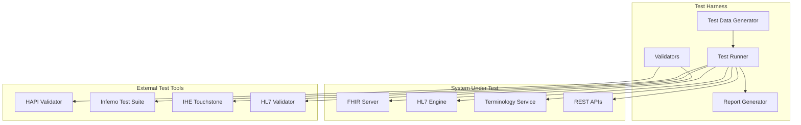

# Haven Health Passport - Interoperability Testing Guide

## Overview

This guide provides comprehensive procedures for testing healthcare data interoperability in the Haven Health Passport system. It covers conformance testing, integration testing, and certification preparation for all supported healthcare standards.

## Table of Contents

1. [Testing Framework Overview](#testing-framework-overview)
2. [FHIR Conformance Testing](#fhir-conformance-testing)
3. [HL7 Message Testing](#hl7-message-testing)
4. [Terminology Service Testing](#terminology-service-testing)
5. [End-to-End Integration Testing](#end-to-end-integration-testing)
6. [Performance Testing](#performance-testing)
7. [Certification Testing](#certification-testing)
8. [Test Data Management](#test-data-management)
9. [Troubleshooting Guide](#troubleshooting-guide)

## Testing Framework Overview

### Test Environment Architecture



### Testing Principles

1. **Automated First**: All tests must be automatable for CI/CD integration
2. **Standards-Based**: Use official test suites where available
3. **Comprehensive Coverage**: Test both positive and negative scenarios
4. **Performance Aware**: Include performance metrics in all tests
5. **Traceable**: Link all tests to requirements and standards

## FHIR Conformance Testing

### FHIR Resource Validation

#### Basic Resource Validation
```bash
# Validate individual FHIR resources
npm run test:fhir:validate -- --resource Patient --file ./test-data/patient-example.json

# Validate against custom profiles
npm run test:fhir:profile -- --profile HavenPatient --file ./test-data/haven-patient.json

# Batch validation
npm run test:fhir:batch -- --directory ./test-data/fhir-resources/
```

#### Conformance Test Suite
```javascript
// Test configuration for FHIR conformance
{
  "testSuites": {
    "core": {
      "resources": ["Patient", "Observation", "Medication", "Condition"],
      "operations": ["create", "read", "update", "delete", "search"],
      "formats": ["json", "xml"]
    },
    "advanced": {
      "operations": ["batch", "transaction", "history", "vread"],
      "features": ["_include", "_revinclude", "chaining", "modifiers"]
    }
  }
}
```

### FHIR Server Testing Checklist

- [ ] **Capability Statement Tests**
  - [ ] Verify server metadata endpoint
  - [ ] Validate supported resources
  - [ ] Check interaction capabilities
  - [ ] Verify search parameters

- [ ] **Resource CRUD Operations**
  - [ ] Create with validation
  - [ ] Read with correct versioning
  - [ ] Update with optimistic locking
  - [ ] Delete with cascading rules
  - [ ] Conditional operations

- [ ] **Search Functionality**
  - [ ] Basic parameter search
  - [ ] Composite search parameters
  - [ ] Chained searches
  - [ ] Include/RevInclude
  - [ ] Paging implementation

- [ ] **Advanced Features**
  - [ ] Batch/Transaction processing
  - [ ] History tracking
  - [ ] Subscription support
  - [ ] Binary resource handling
  - [ ] Custom operations

### Inferno Test Suite Integration

```yaml
# inferno-config.yml
test_suites:
  - us_core_v4:
      base_url: "https://fhir.havenpassport.org/r4"
      client_id: "inferno_test_client"
      scopes: "launch patient/*.read"

  - international_patient_summary:
      base_url: "https://fhir.havenpassport.org/r4"
      validate_references: true

  - bulk_data_export:
      base_url: "https://fhir.havenpassport.org/r4"
      bulk_timeout: 600

test_options:
  validate_responses: true
  check_response_times: true
  max_response_time_ms: 1000
```

## HL7 Message Testing

### Message Validation Tests

#### HL7 v2.x Message Testing
```python
# HL7 v2 test framework
class HL7MessageTests:
    def test_adt_a01_admission(self):
        """Test patient admission message"""
        message = """
        MSH|^~\\&|HAVEN|FACILITY|RECEIVER|DEST|20240531120000||ADT^A01|MSG001|P|2.9
        EVN|A01|20240531120000
        PID|1||PAT001^^^HAVEN^MR||Doe^John^A||19800515|M|||123 Main St^^City^ST^12345
        """
        result = self.validator.validate(message)
        assert result.is_valid
        assert result.message_type == "ADT^A01"

    def test_orm_o01_order(self):
        """Test order message"""
        # Implementation details...

    def test_oru_r01_results(self):
        """Test observation results"""
        # Implementation details...
```

#### Message Routing Tests
```yaml
# HL7 routing test configuration
routing_tests:
  - name: "ADT to FHIR Patient"
    input:
      message_type: "ADT^A01"
      test_file: "adt_a01_sample.hl7"
    expected:
      fhir_resource: "Patient"
      operations: ["create", "update"]

  - name: "ORM to FHIR ServiceRequest"
    input:
      message_type: "ORM^O01"
      test_file: "orm_o01_sample.hl7"
    expected:
      fhir_resource: "ServiceRequest"
      status_workflow: true
```

### HL7 Performance Testing

```javascript
// HL7 performance test suite
const performanceTests = {
  "message_parsing": {
    "target_rate": 1000, // messages per second
    "max_latency_ms": 100,
    "test_duration_seconds": 300
  },
  "concurrent_connections": {
    "max_connections": 100,
    "messages_per_connection": 1000,
    "connection_timeout_ms": 5000
  }
};
```

## Terminology Service Testing

### Code System Validation

#### SNOMED CT Testing
```javascript
// SNOMED CT test cases
describe('SNOMED CT Service', () => {
  test('Concept lookup', async () => {
    const result = await terminologyService.lookup({
      system: 'http://snomed.info/sct',
      code: '38341003',
      version: '20240301'
    });

    expect(result.display).toBe('Hypertensive disorder');
    expect(result.designation).toContainEqual({
      language: 'en',
      value: 'High blood pressure'
    });
  });

  test('Subsumption testing', async () => {
    const result = await terminologyService.subsumes({
      system: 'http://snomed.info/sct',
      codeA: '73211009', // Diabetes mellitus
      codeB: '44054006'  // Type 2 diabetes
    });

    expect(result.outcome).toBe('subsumes');
  });
});
```

#### Multi-Terminology Mapping Tests
```yaml
terminology_mappings:
  - name: "ICD-10 to SNOMED CT"
    test_cases:
      - icd10: "I10"
        expected_snomed: ["38341003", "59621000"]
        mapping_type: "equivalent"

  - name: "LOINC to SNOMED Observable"
    test_cases:
      - loinc: "2160-0"
        expected_snomed: "166830008"
        mapping_type: "broader"
```

### Terminology Performance Tests

```javascript
const terminologyPerformanceTests = {
  "lookup_latency": {
    "target_p50_ms": 10,
    "target_p95_ms": 25,
    "target_p99_ms": 50
  },
  "batch_validation": {
    "batch_size": 1000,
    "target_time_seconds": 5
  },
  "expansion_performance": {
    "small_valueset_ms": 100,    // < 100 concepts
    "medium_valueset_ms": 500,   // < 1000 concepts
    "large_valueset_ms": 2000    // < 10000 concepts
  }
};
```

## End-to-End Integration Testing

### Clinical Workflow Tests

#### Patient Registration Flow
```gherkin
Feature: Patient Registration through Multiple Interfaces

  Scenario: Register patient via HL7 ADT and retrieve via FHIR
    Given an HL7 ADT^A01 admission message
    When the message is processed by the HL7 interface
    Then a FHIR Patient resource should be created
    And the Patient should be searchable by identifier
    And audit logs should show the transformation

  Scenario: Update patient demographics via FHIR API
    Given an existing patient in the system
    When demographics are updated via FHIR API
    Then HL7 ADT^A08 update message should be generated
    And downstream systems should receive the update
    And data should be consistent across all interfaces
```

#### Laboratory Results Flow
```javascript
// End-to-end lab results test
async function testLabResultsFlow() {
  // 1. Create order via HL7 ORM
  const orderMessage = createHL7Order({
    patient: 'PAT001',
    test: 'CBC',
    priority: 'STAT'
  });
  await hl7Interface.send(orderMessage);

  // 2. Verify FHIR ServiceRequest created
  const serviceRequest = await fhirClient.search({
    resourceType: 'ServiceRequest',
    searchParams: {
      identifier: 'ORD001'
    }
  });
  expect(serviceRequest.total).toBe(1);

  // 3. Send results via HL7 ORU
  const resultMessage = createHL7Result({
    order: 'ORD001',
    results: {
      'WBC': { value: 7.2, unit: '10*9/L' },
      'HGB': { value: 14.5, unit: 'g/dL' }
    }
  });
  await hl7Interface.send(resultMessage);

  // 4. Verify FHIR Observations created
  const observations = await fhirClient.search({
    resourceType: 'Observation',
    searchParams: {
      'service-request': serviceRequest.entry[0].resource.id
    }
  });
  expect(observations.total).toBe(2);

  // 5. Verify terminology mappings
  const wbcObs = observations.entry.find(e =>
    e.resource.code.coding[0].code === '6690-2'
  );
  expect(wbcObs.resource.code.coding).toContainEqual({
    system: 'http://loinc.org',
    code: '6690-2',
    display: 'Leukocytes [#/volume] in Blood by Automated count'
  });
}
```

### Cross-System Data Consistency Tests

```yaml
consistency_test_suite:
  patient_data:
    systems:
      - fhir_server
      - hl7_interface
      - terminology_service
    test_points:
      - identifiers_match
      - demographics_synchronized
      - terminology_codes_valid
      - audit_trail_complete

  clinical_data:
    systems:
      - fhir_server
      - document_store
      - analytics_db
    test_points:
      - observations_replicated
      - medications_consistent
      - conditions_mapped_correctly
```

## Performance Testing

### Load Testing Configuration

```yaml
# load-test-config.yml
scenarios:
  - name: "Mixed Clinical Workload"
    duration: 3600  # 1 hour
    users:
      ramp_up_time: 300  # 5 minutes
      target_users: 1000

    operations:
      - operation: "patient_search"
        weight: 30
        think_time: [1, 5]

      - operation: "observation_create"
        weight: 25
        think_time: [2, 10]

      - operation: "medication_lookup"
        weight: 20
        think_time: [1, 3]

      - operation: "document_retrieve"
        weight: 15
        think_time: [5, 15]

      - operation: "terminology_validate"
        weight: 10
        think_time: [1, 2]

    thresholds:
      response_time_p95: 500
      response_time_p99: 1000
      error_rate: 0.001
      throughput_min: 5000  # ops/sec
```

### Stress Testing Procedures

```javascript
// Stress test implementation
class StressTestRunner {
  async runDegradationTest() {
    const results = [];
    let currentLoad = 100;

    while (true) {
      const metrics = await this.runLoadTest({
        users: currentLoad,
        duration: 300,  // 5 minutes
        rampUp: 60     // 1 minute
      });

      results.push({
        load: currentLoad,
        metrics: metrics
      });

      // Check for degradation
      if (metrics.errorRate > 0.01 ||
          metrics.p95ResponseTime > 2000) {
        break;
      }

      currentLoad += 100;
    }

    return {
      maxSustainableLoad: results[results.length - 2].load,
      breakingPoint: currentLoad,
      degradationCurve: results
    };
  }
}
```

## Certification Testing

### ONC Health IT Certification

#### Test Procedure Mapping
```json
{
  "certification_criteria": {
    "170.315(a)(1)": {
      "name": "Transitions of Care",
      "test_procedures": [
        "create_ccda_document",
        "import_ccda_document",
        "reconcile_medications",
        "reconcile_problems"
      ]
    },
    "170.315(a)(5)": {
      "name": "Problem List",
      "test_procedures": [
        "create_problem",
        "update_problem_status",
        "code_problem_snomed",
        "code_problem_icd10"
      ]
    },
    "170.315(g)(7)": {
      "name": "Application Access",
      "test_procedures": [
        "register_app",
        "authorize_app",
        "patient_data_access",
        "refresh_token"
      ]
    }
  }
}
```

#### Certification Test Execution

```bash
#!/bin/bash
# ONC Certification Test Runner

echo "Starting ONC Certification Test Suite"

# Run Inferno US Core tests
npm run test:certification:uscore

# Run FHIR API tests
npm run test:certification:api

# Run Security tests
npm run test:certification:security

# Run CDA generation tests
npm run test:certification:cda

# Generate certification report
npm run report:certification:generate

echo "Certification tests complete. Check ./reports/certification/ for results."
```

### IHE Profile Testing

```yaml
ihe_profiles:
  - profile: "PIX/PDQ"
    tests:
      - patient_identity_feed
      - patient_demographics_query
      - patient_cross_reference

  - profile: "XDS.b"
    tests:
      - document_submission
      - document_query
      - document_retrieve

  - profile: "mACM"
    tests:
      - alert_report
      - alert_query
      - alert_dissemination
```

## Test Data Management

### Synthetic Data Generation

```javascript
// Test data generator configuration
const testDataConfig = {
  patients: {
    count: 10000,
    demographics: {
      ageDistribution: 'normal',
      genderRatio: 0.5,
      ethnicities: ['diverse']
    },
    conditions: {
      prevalence: {
        'hypertension': 0.3,
        'diabetes': 0.1,
        'asthma': 0.08
      }
    }
  },

  observations: {
    perPatient: {
      min: 10,
      max: 100
    },
    types: [
      'vital-signs',
      'laboratory',
      'imaging'
    ]
  },

  medications: {
    perPatient: {
      min: 0,
      max: 15
    },
    adherenceRate: 0.8
  }
};

// Generate test data
async function generateTestData() {
  const generator = new SyntheticDataGenerator(testDataConfig);

  // Generate patients
  const patients = await generator.generatePatients();

  // Generate clinical data for each patient
  for (const patient of patients) {
    await generator.generateClinicalData(patient);
  }

  // Export in multiple formats
  await generator.export({
    formats: ['fhir-bundle', 'hl7-messages', 'csv'],
    outputDir: './test-data/synthetic/'
  });
}
```

### Test Data Privacy

```yaml
data_privacy_rules:
  deidentification:
    - remove_direct_identifiers
    - shift_dates_randomly
    - generalize_locations
    - remove_rare_conditions

  test_accounts:
    prefix: "TEST_"
    domains: ["test.havenpassport.org"]
    auto_cleanup: true
    retention_days: 30
```

## Troubleshooting Guide

### Common Integration Issues

#### FHIR Server Connection Issues
```bash
# Diagnostic commands
curl -X GET "https://fhir.havenpassport.org/r4/metadata" \
  -H "Accept: application/fhir+json"

# Check server logs
docker logs haven-fhir-server --tail 100

# Verify network connectivity
nslookup fhir.havenpassport.org
traceroute fhir.havenpassport.org
```

#### HL7 Message Parsing Failures
```javascript
// HL7 debugging utility
function debugHL7Message(message) {
  const lines = message.split('\r');

  console.log('Message Structure:');
  lines.forEach((segment, index) => {
    const fields = segment.split('|');
    console.log(`  ${index}: ${fields[0]} - ${fields.length} fields`);

    if (fields[0] === 'MSH') {
      console.log(`    Encoding: ${fields[1]}`);
      console.log(`    Message Type: ${fields[8]}`);
      console.log(`    Version: ${fields[11]}`);
    }
  });

  // Check for common issues
  checkEncodingCharacters(message);
  checkSegmentTerminators(message);
  checkRequiredSegments(message);
}
```

#### Terminology Service Errors

```yaml
terminology_troubleshooting:
  common_issues:
    - issue: "Code system not found"
      diagnosis:
        - check_system_url_format
        - verify_system_loaded
        - check_version_parameter
      solution:
        - load_missing_system
        - update_system_url
        - specify_version

    - issue: "Expansion timeout"
      diagnosis:
        - check_valueset_size
        - verify_hierarchy_depth
        - check_server_resources
      solution:
        - implement_pagination
        - optimize_expansion_query
        - increase_server_resources
```

### Performance Troubleshooting

```javascript
// Performance diagnostic tool
class PerformanceDiagnostics {
  async runDiagnostics() {
    const diagnostics = {
      database: await this.checkDatabasePerformance(),
      cache: await this.checkCacheHitRate(),
      network: await this.checkNetworkLatency(),
      cpu: await this.checkCPUUtilization(),
      memory: await this.checkMemoryUsage()
    };

    // Generate recommendations
    const recommendations = this.analyzeResults(diagnostics);

    return {
      diagnostics,
      recommendations,
      timestamp: new Date().toISOString()
    };
  }

  async checkDatabasePerformance() {
    // Check slow queries
    const slowQueries = await db.getSlowQueries({ threshold: 1000 });

    // Check connection pool
    const poolStats = await db.getPoolStatistics();

    // Check index usage
    const indexStats = await db.getIndexStatistics();

    return {
      slowQueries,
      poolStats,
      indexStats
    };
  }
}
```

## Appendix A: Test Tool Installation

### Required Testing Tools

```bash
# Install HAPI FHIR Validator
wget https://github.com/hapifhir/org.hl7.fhir.core/releases/latest/download/validator_cli.jar

# Install Inferno
git clone https://github.com/onc-healthit/inferno-program.git
cd inferno-program
docker-compose up -d

# Install HL7 Validator
npm install -g hl7-validator

# Install Touchstone client
wget https://www.ihe.net/touchstone-client-latest.jar
```

### Test Environment Setup

```yaml
# docker-compose.test.yml
version: '3.8'

services:
  test-fhir-server:
    image: hapiproject/hapi:latest
    environment:
      - HAPI_FHIR_VALIDATION_ENABLED=true
      - HAPI_FHIR_SUBSCRIPTION_ENABLED=true

  test-terminology:
    image: haven/terminology-service:latest
    volumes:
      - ./test-data/terminology:/data

  test-validator:
    image: haven/validator-service:latest
    depends_on:
      - test-fhir-server
      - test-terminology

  test-runner:
    image: haven/test-runner:latest
    volumes:
      - ./test-results:/results
      - ./test-data:/data
```

## Appendix B: Continuous Integration

### CI/CD Pipeline Configuration

```yaml
# .github/workflows/interoperability-tests.yml
name: Interoperability Tests

on:
  push:
    branches: [main, develop]
  pull_request:
    branches: [main]

jobs:
  fhir-tests:
    runs-on: ubuntu-latest
    steps:
      - uses: actions/checkout@v3

      - name: Setup test environment
        run: docker-compose -f docker-compose.test.yml up -d

      - name: Run FHIR conformance tests
        run: npm run test:fhir:conformance

      - name: Run Inferno tests
        run: npm run test:inferno

      - name: Upload test results
        uses: actions/upload-artifact@v3
        with:
          name: fhir-test-results
          path: ./test-results/fhir/

  hl7-tests:
    runs-on: ubuntu-latest
    steps:
      - uses: actions/checkout@v3

      - name: Run HL7 message tests
        run: npm run test:hl7

      - name: Run HL7 performance tests
        run: npm run test:hl7:performance

  integration-tests:
    runs-on: ubuntu-latest
    needs: [fhir-tests, hl7-tests]
    steps:
      - name: Run end-to-end tests
        run: npm run test:e2e

      - name: Generate test report
        run: npm run report:generate

      - name: Check test coverage
        run: npm run coverage:check
```

## Appendix C: Certification Checklist

### Pre-Certification Checklist

- [ ] **Documentation Review**
  - [ ] API documentation complete
  - [ ] Implementation guides updated
  - [ ] Test procedures documented
  - [ ] Known issues documented

- [ ] **Test Coverage**
  - [ ] Unit tests > 90% coverage
  - [ ] Integration tests passing
  - [ ] Performance benchmarks met
  - [ ] Security tests passed

- [ ] **Compliance Verification**
  - [ ] HIPAA controls implemented
  - [ ] Audit logs functional
  - [ ] Encryption verified
  - [ ] Access controls tested

- [ ] **External Testing**
  - [ ] Inferno tests passing
  - [ ] Touchstone tests passing
  - [ ] Third-party integration verified
  - [ ] User acceptance testing complete

### Certification Submission

1. **Prepare Test Environment**
   - Dedicated certification instance
   - Test data loaded
   - Monitoring enabled
   - Support team ready

2. **Documentation Package**
   - Implementation notes
   - Test results
   - Security assessment
   - Conformance statements

3. **Schedule Testing**
   - Coordinate with certifier
   - Prepare test scripts
   - Assign technical contacts
   - Plan remediation time

## Conclusion

This Interoperability Testing Guide provides a comprehensive framework for validating the Haven Health Passport's compliance with healthcare standards. Regular execution of these tests ensures continued interoperability and readiness for certification.

For questions or support, contact:
- Technical: interop-testing@havenpassport.org
- Certification: certification@havenpassport.org
